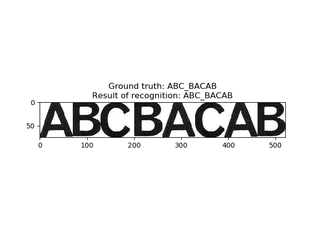
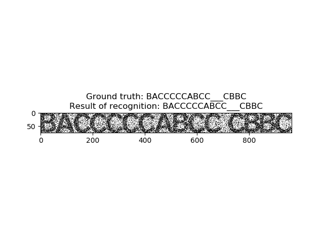
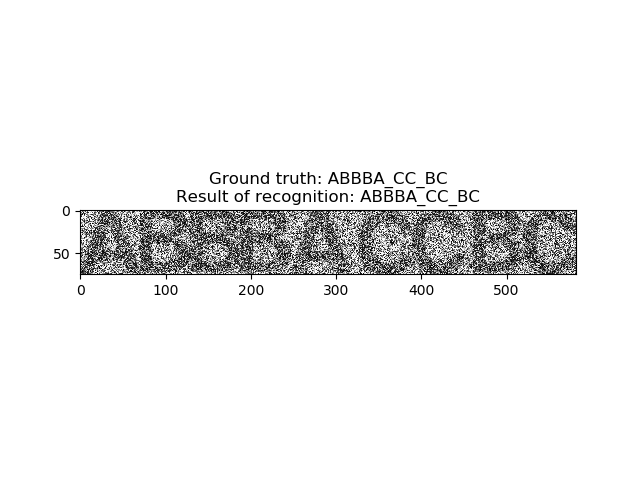
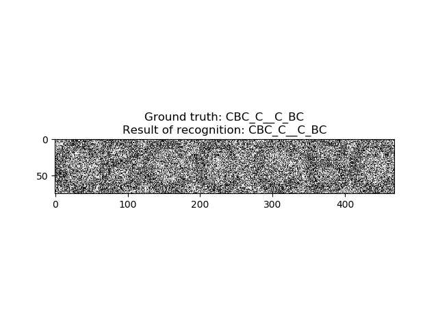
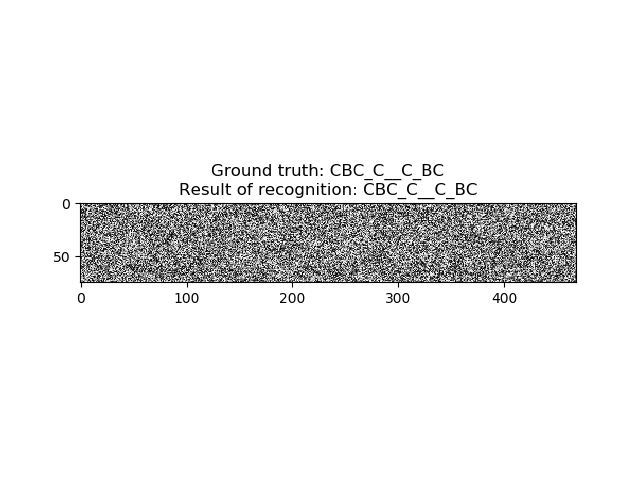
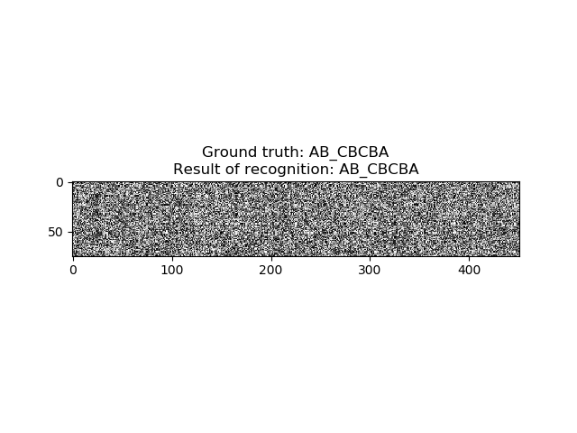

# Generalized labelling on chains

## About

Demonstration of generalized labelling algorithm for text recognition task. Generalized labelling means that labelling
is performed for a set of objects, where notion of neighborhood is generalized, so every object can have arbitrary amount
of previous objects as neighbors. Algorithm is based on dynamic programming.

## Requirements

- PIL
- numpy
- matplotlib

## Result

Without noise:

Noise 0.5:

Noise 0.75:

Noise 0.85:

Noise 0.95:

Noise 0.96:

## How to install

$ git clone https://github.com/GreyCoder25/MarkUpProblemOnChains

## How to run

$ python main.py

String to recognize and noise are specified in line 32 of main.py.

